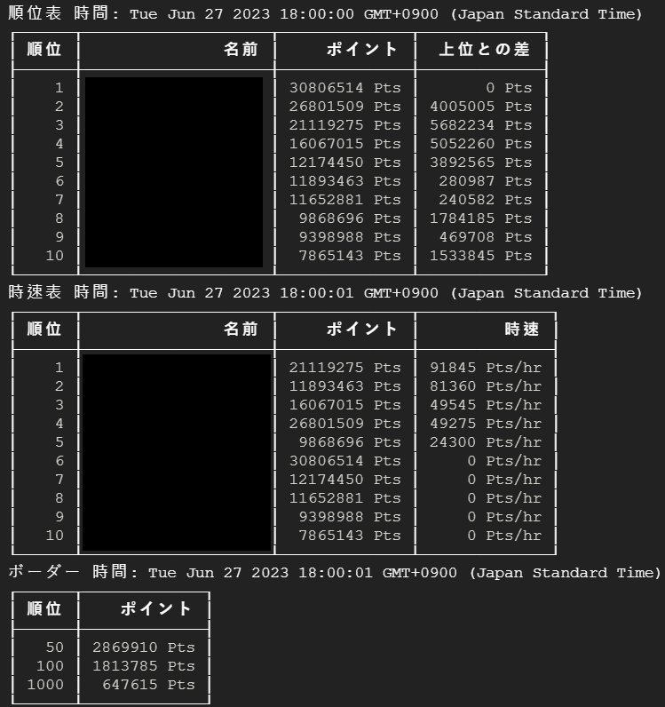

# event-tracker

Get garupa Jp-event Top10 tracker and boader 50, 100, 1000 bot

<!-- https://bestdori.com/api/eventtop/data?server=0&event=${eventID}&mid=0&latest=1 -->
<!-- ${server}: {"0": "jp"}, {"1": "en"}, {"2": "tw"}, {"3": "cn"}, {"4": "kr"} -->
<!-- ${eventID} -->

``` cmd
node main.js --eventID=${eventID}
```

## Resault


<!-- No. ID sumpoints diff-pre-points diff-sort -->
